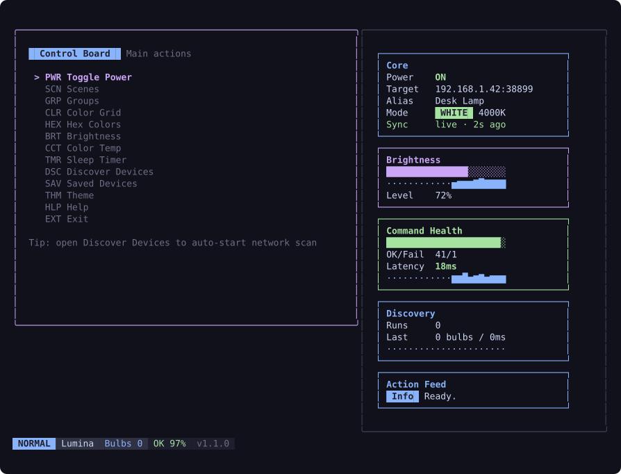
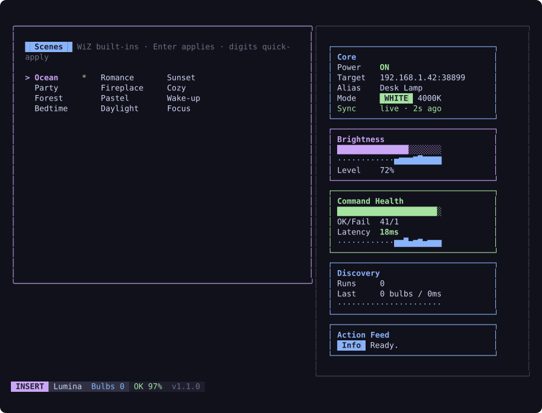
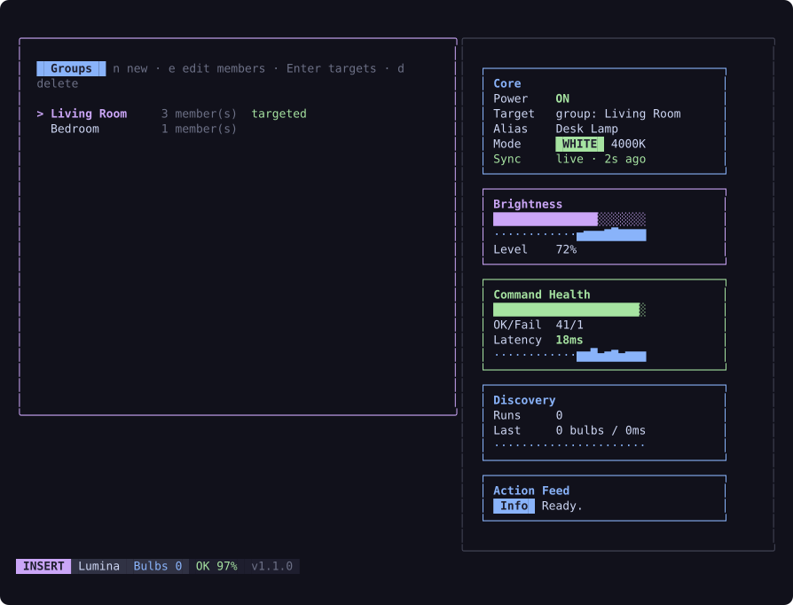
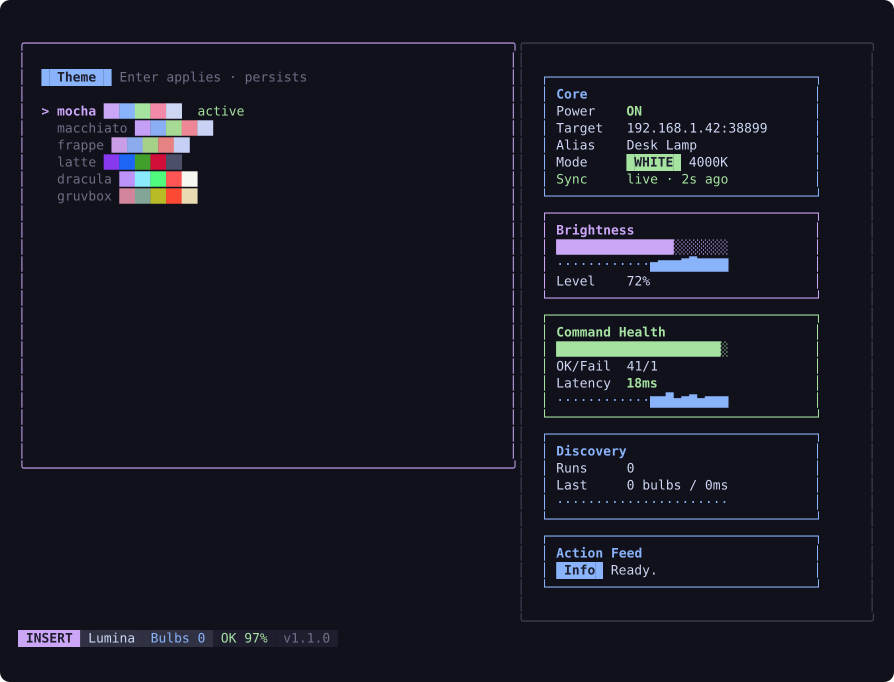

# Lumina-TUI

[](https://github.com/shivarchit/Lumina-TUI/actions/workflows/ci.yml)

Lumina-TUI is a terminal user interface for controlling WiZ smart lights and plugs locally over UDP.

It is built in Go with Bubble Tea and is intended for fast, local control from the terminal.



---

## Features

- **Zero cloud dependency**  
  Communicates directly with your lights over your local network using UDP port `38899`.  
  No accounts, no cloud, instant response times.

- **Live dashboard**  
  A 10-second sync heartbeat keeps the panel honest even when the bulb changes from the phone app. The Core panel shows the real mode — `WHITE` with kelvin, or `COLOR` with a swatch — plus a `live · Ns ago` sync indicator.

- **Scenes**  
  Twelve WiZ firmware scenes (Ocean, Party, Fireplace, Focus, ...) in a grid with live preview while you browse and digit keys for one-press apply.

  

- **Device groups**  
  Name a set of saved bulbs and target them together — power, brightness, color, temp, and scenes fan out concurrently with one aggregated result line ("Living Room → Power: ON (3/3 ok)").

  

- **Themes**  
  Six built-in palettes — Catppuccin Mocha (default), Macchiato, Frappé, Latte for light terminals, Dracula, and Gruvbox — applied live and persisted.

  

- **Scriptable CLI**  
  Every core action works headless: `lumina on`, `lumina color '#89B4FA'`, `lumina scene party`, `lumina status`. Bare `lumina` opens the TUI. Pairs with cron for scheduling.

- **21-color visual grid**  
  A fully interactive, responsive grid of curated colors for quick mood setting.

- **Custom hex input**  
  Type any valid hex code (e.g., `#CBA6F7`) to dial in the exact color you want.

- **Visual brightness slider**  
  Adjust dimming levels smoothly using arrow keys or Vim-style navigation.

- **Background sleep timer**  
  Set a timer and watch the animated status spinner run while the UI remains fully interactive.

- **Smart bulb discovery**  
  Auto-scans local subnets, de-duplicates bulbs by MAC/IP, and lets you select and persist a target instantly.

- **Saved device profiles**  
  Save discovered bulbs with custom names and quickly re-select them across app restarts.

- **Live telemetry panel**  
  A btop-inspired dashboard shows command health, latency sparklines, brightness trend, and discovery performance.

- **Clean terminal interface**  
  Multi-pane layout, dynamic border highlights, and a Vim-style bottom status bar (Normal/Insert modes).

---

## Installation

### Prerequisites

- Go 1.25 or higher installed on your machine.

---

### 1) Clone the repository

```bash
git clone https://github.com/shivarchit/Lumina-TUI.git
cd Lumina-TUI
```

---

### 2) Configure your device

Create a `.env` file in the root directory and add your light's local IP address:

```env
WIZ_IP=192.168.1.15
WIZ_PORT=38899
```

> You can find your device's IP address in the WiZ mobile app under **Settings -> Lights**.

---

### 3) Install dependencies

```bash
go mod tidy
```

---

### 4) Run the app

```bash
go run ./internal
```

---

## Build a standalone binary

To use Lumina-TUI without `go run`, compile it into a single executable:

```bash
go build -o lumina ./internal
```

### macOS / Linux

Move the `lumina` binary to `/usr/local/bin` to access it globally:

```bash
sudo mv lumina /usr/local/bin
```

Then simply run:

```bash
lumina
```

### Windows (PowerShell)

Build a Windows executable:

```powershell
go build -o lumina.exe ./internal
```

Create a user bin folder and move the executable there:

```powershell
New-Item -ItemType Directory -Force "$env:USERPROFILE\bin" | Out-Null
Move-Item -Force .\lumina.exe "$env:USERPROFILE\bin\lumina.exe"
```

Add your user bin folder to `PATH` (one-time setup):

```powershell
setx PATH "$env:PATH;$env:USERPROFILE\bin"
```

Close and reopen PowerShell, then run:

```powershell
lumina
```

---

## Controls

The interface is fully keyboard-driven:

- `Up` / `Down` or `k` / `j` - Navigate the menu, grids, and lists  
- `Left` / `Right` or `h` / `l` - Adjust brightness or move horizontally  
- `1`-`9`, `0` - Jump to menu entries; in Scenes, apply a scene instantly  
- `Enter` - Select / Confirm / Target a group  
- `r` - Refresh device discovery scan  
- `s` - Save selected discovered device with a custom name  
- `d` - Delete selected saved device or group  
- `n` / `e` / `Space` - New group / edit members / toggle membership (Groups view)  
- `Esc` - Cancel input mode / back out  
- `q` or `Ctrl + C` - Quit application  

---

## CLI

Every core action is scriptable without opening the TUI — bare `lumina` still opens it:

```bash
lumina on                    # power on the active device
lumina off
lumina color '#89B4FA'       # any hex color
lumina temp 4000             # white mode, 2200-6500 K
lumina scene party           # by name (ocean, romance, sunset, party, fireplace,
                             # cozy, forest, pastel, wake-up, bedtime, daylight, focus)
lumina scene 27              # or any WiZ scene id 1-32
lumina status                # one line per saved device
lumina discover              # scan the local network
```

Scheduling needs nothing extra — pair it with cron:

```cron
0 21 * * * lumina temp 2700   # warm white every evening
0 23 * * * lumina off
```

---

## Project structure

Lumina-TUI follows a modular architecture:

- `internal/main.go` - CLI entry point  
- `internal/app/run.go` - startup flow, CLI verbs, and timer worker  
- `internal/config/config.go` - config validation and persistence  
- `internal/ui/` - Bubble Tea model, update loop, and rendering  
- `internal/wiz/client.go` - UDP networking and discovery logic  
- `internal/version/version.go` - application version constant  
- `build/release.sh` - cross-platform release build script  
- `docs/screenshots/` - README screenshots (regenerate: `GEN_SCREENSHOTS=$(pwd)/docs/screenshots go test ./internal/ui -run TestGenerateScreenshots`)  
- `tests/` - black-box tests per package (`app`, `config`, `ui`, `wiz`)  

---

## Testing

Run all tests:

```bash
go test ./...
```

Run only UI tests:

```bash
go test ./tests/ui/...
```

Run only WiZ client tests:

```bash
go test ./tests/wiz/...
```

---

## CI

GitHub Actions runs tests automatically on push to `main` and on pull requests.

- Workflow file: `.github/workflows/ci.yml`
- Command used in CI: `go test ./...`

---

## Releases

Separate release scripts are available for Unix and Windows.

Unix (macOS/Linux):

```bash
bash build/release.sh
```

Unix dry run (build + package only, no tag push/release upload):

```bash
bash build/release.sh all --dry-run
```

Windows (PowerShell):

```powershell
.\build\release.ps1
```

Windows dry run (build + package only, no tag push/release upload):

```powershell
.\build\release.ps1 -Target all -DryRun
```

Optional single-target build:

- Unix: `bash build/release.sh linux/amd64`
- Windows: `.\build\release.ps1 -Target linux/amd64`

Both scripts:

- build binaries into `dist/`
- generate `checksums.txt`
- create an archive
- ensure/push the git tag from `internal/version/version.go`
- upload assets to GitHub Releases using `gh`

---

## How it works

WiZ devices expose a local UDP API. Lumina-TUI sends structured JSON payloads directly to port `38899`.

Example payload for setting a custom color:

```json
{
  "method": "setPilot",
  "params": {
    "r": 203,
    "g": 166,
    "b": 247,
    "dimming": 100
  }
}
```

---

## Contributing

Contributions are welcome.
Feel free to open an issue or submit a pull request for features such as:

- Multi-light broadcasting  
- Scene support  
- Device auto-discovery  

---

## License

Distributed under the MIT License. See `LICENSE` for more information.